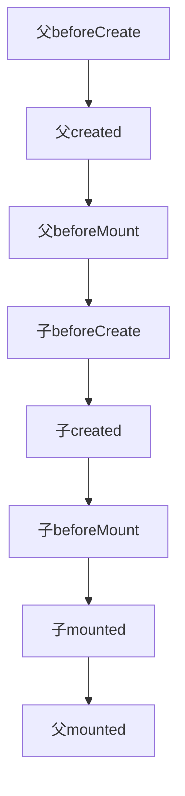
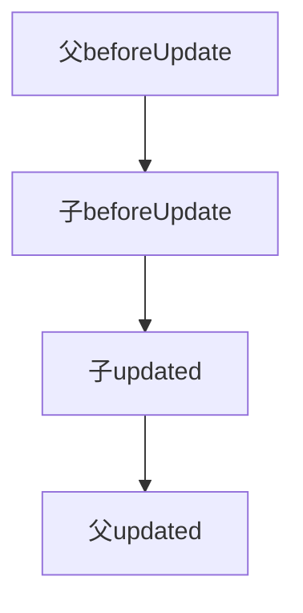
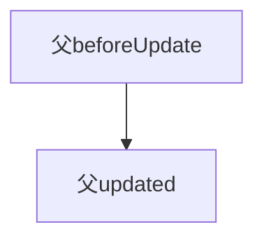
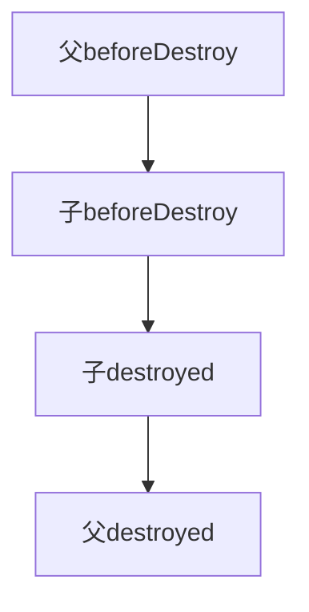

# 父子组件生命周期钩子函数执行顺序

## 初始化组件时

```mermaid
graph TD
父beforeCreate --> 父created --> 父beforeMount --> 子beforeCreate --> 子created --> 子beforeMount --> 子mounted --> 父mounted
```

## 子组件更新时

```mermaid
graph TD
父beforeUpdate --> 子beforeUpdate --> 子updated --> 父updated
```

## 父组件更新时

```mermaid
graph TD
父beforeUpdate --> 父updated
```

## 销毁时

```mermaid
graph TD
父beforeDestroy --> 子beforeDestroy --> 子destroyed --> 父destroyed
```
